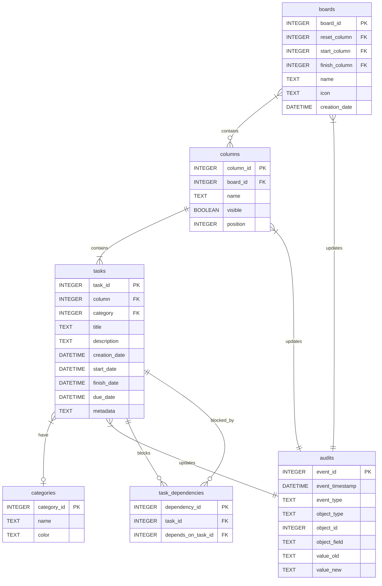

<!-- Icons -->
[](https://github.com/astral-sh/ruff)
[](https://pypi.org/project/kanban-tui/)
[](https://pypi.python.org/pypi/kanban-tui)
[](https://opensource.org/licenses/MIT)
[](https://pepy.tech/project/kanban-tui)
[](https://coveralls.io/github/Zaloog/kanban-tui?branch=main)

# kanban-tui

A customizable terminal-based task manager powered by [Textual][textual] with multiple backends.
Now also usable in co-op mode with AI agents (check the [CLI interface](#cli-interface) and [MCP Server](#mcp-server) section for more info).

> [!NOTE]
> This repository is a derivative of [**Zaloog/kanban-tui**](https://github.com/Zaloog/kanban-tui) by Lars Grams,
> maintained separately for experimentation. All credit for the original work belongs to
> the upstream authors. Distributed under the MIT License — see [LICENSE.txt](LICENSE.txt).

## Demo


Try `kanban-tui` instantly without installation:

```bash
uvx kanban-tui demo
```

## Features

<details><summary>following the xdg basedir convention</summary>

kanban-tui utilizes [pydantic-settings] and [xdg-base-dirs] `user_config_dir` to save
the config file and `user_data_dir` for the sqlite database.
you can get an overview of all file locations with `uvx kanban-tui info`
</details>

<details><summary>Customizable Board</summary>

kanban-tui comes with four default columns
(`Ready`, `Doing`, `Done`, `Archive`) but can be customized to your needs.
More columns can be created via the `Settings`-Tab. Also the visibility and order of columns can be adjusted.
Deletion of existing columns is only possible, if no task is present in the column you want to delete.
</details>

<details><summary>Multiple Backends</summary>

kanban-tui currently supports three backends.
- **sqlite** (default) | Supports all features of `kanban-tui`
- **jira** | Connect to your jira instance via api key and query tasks via jql.
Columns are defined by task transitions.
- **claude** | Read the `.json` files under `~/.claude/tasks/`. Boards are created for each session ID.
Supports only a subset of features


</details>

<details><summary>Multi Board Support</summary>

With version v0.4.0 kanban-tui allows the creation of multiple boards.
Use `f` on the `Kanban Board`-Tab to filter the board down to one category (or to
tasks without a category); the choice is remembered per board between sessions.

Use `B` on the `Kanban Board`-Tab to get an overview over all Boards including
the amount of columns, tasks and the earliest Due Date.
</details>

<details><summary>Task Management</summary>

When on the `Kanban Board`-Tab you can `create (n)`, `edit (e)`, `delete (d)`, move between columns (`H`, `L`), or reorder within a column (`J` down / `K` up).
Movement between columns and reordering within a column are also supported via mouse drag and drop.
Task dependencies can be defined, which restrict movement to the `Doing` (start_column).
To have the restrictions available, the status columns must be defined on the settings screen.
</details>

<details><summary>Task Dependencies</summary>

Tasks can have dependencies on other tasks, creating a workflow where certain tasks must be completed before others can proceed.
- **Add Dependencies**: When editing a task, use the dependency selector dropdown to add other tasks as dependencies
- **Remove Dependencies**: Select a dependency in the table and press enter to remove it
- **Blocking Prevention**: Tasks with unfinished dependencies cannot be moved to start/finish columns
- **Circular Detection**: The system prevents circular dependencies (Task A depends on Task B, Task B depends on Task A)
- **Visual Indicators**: Task cards show visual cues for dependency status:
  - 🔒 "Blocked by X unfinished tasks" - Task has dependencies that aren't finished yet
  - ❗ "Blocking Y tasks" - Other tasks depend on this one
  - ✅ "No dependencies" - Task has no dependency relationships
- **CLI Support**: Dependencies can be managed via the CLI with the `--depends-on` flag when creating tasks, or using the `--force` flag to override blocking when moving tasks
</details>

<details><summary>Database Information</summary>
The current database schema looks as follows.
The Audit table is filled automatically based on triggers.


</details>

<details><summary>Visual Summary and Audit Table</summary>

To give you an overview over the amount of tasks you `created`, `started` or `finished`, kanban-tui
provides an `Overview`-Tab to show you a bar-chart on a `monthly`, `weekly` or `daily` scale.
It also can be changed to a stacked bar chart per category.
This feature is powered by the [plotext] library with help of [textual-plotext].
There is also an audit table, which tracks the creation/update/deletion of tasks/boards and columns.
</details>

## Installation

You can install `kanban-tui` with one of the following options:

```bash
uv tool install kanban-tui
```

```bash
pipx install kanban-tui
```

```bash
# not recommended
pip install kanban-tui
```

I recommend using [pipx] or [uv] to install CLI Tools into an isolated environment.

To be able to use `kanban-tui` in your browser with the `--web`-flag, the optional dependency
`textual-serve` is needed. You can add this to `kanban-tui` by installing the optional `web`-dependency
with the installer of your choice, for example with [uv]:

```bash
uv tool install 'kanban-tui[web]'
```


## Usage
kanban-tui now also supports the `kanban-tui` entrypoint besides `ktui`.
This was added to support easier installation via [uv]'s `uvx` command.

### Normal Mode
Start `kanban-tui` with by just running the tool without any command. The application can be closed by pressing `ctrl+q`.
Pass the `--web` flag and follow the shown link to open `kanban-tui` in your browser.
```bash
ktui
```

### Demo Mode
Creates a temporary Config and Database which is populated with example Tasks to play around.
Kanban-Tui will delete the temporary Config and Database after closing the application.
Pass the `--clean` flag to start with an empty demo app.
Pass the `--keep` flag to tell `kanban-tui` not to delete the temporary Database and Config.
Pass the `--web` flag and follow the shown link to open `kanban-tui` in your browser.

```bash
ktui demo
```

### Clear Database and Configuration
If you want to start with a fresh database and configuration file, you can use this command to
delete your current database and configuration file.

```bash
ktui clear
```

### Create or Update Agent SKILL.md File
With version v0.11.0 kanban-tui offers a [CLI Interface](#cli-interface-to-manage-tasks) to manage tasks, boards and columns.
This is targeted mainly for agentic use e.g. via [Claude][claude-code], because references will be made only by ids, but some commands
are also ergonomic for human use (e.g. task or board creation).

```bash
ktui skill init/update/delete
```

### CLI Interface to manage Tasks
The commands to manage tasks, boards and columns via the CLI are all build up similarly. For detailed overview of arguments
and options please use the `--help` command.
Note that not every functionality is supported yet (e.g. category management, column customisation).

```bash
ktui task list/create/update/move/delete
ktui board list/create/delete/activate
ktui column list
```

### MCP Server
In addition to skills, `kanban-tui` can be run as a local mcp server, which exposes the `ktui task/board/column` commands.
This requires the optional `mcp` dependency, which can be installed via `uv tool install kanban-tui[mcp]`. It utilizes [pycli-mcp]
to directly expose the commands.
Using the bare `ktui mcp` command shows the instruction to add `kanban-tui` mcp to [claude-code]. The server itself is
started using the `--start-server` flag.

```bash
ktui mcp
```

#### MCP over HTTP(S) for several agents
`ktui mcp --transport http` serves the same tools as one always-on Streamable-HTTP endpoint,
so every agent on the LAN can work the *same* board through a plain MCP client entry (a URL and a
token) with no shell or ssh access to the machine that owns the board. Every request must carry
`Authorization: Bearer <token>`; anything else, on any path, is answered `401`.

```bash
ktui mcp --gen-token                                   # writes ~/.config/kanban_tui/mcp-token (0600), prints it once
ktui mcp --start-server --transport http --host 192.168.0.222 --port 5057
```

On each agent (Claude Code):

```bash
claude mcp add --transport http --scope user ktui http://192.168.0.222:5057/mcp \
    --header 'Authorization: Bearer <TOKEN>'
claude mcp list        # ktui: http://192.168.0.222:5057/mcp (HTTP) - ✔ Connected
```

or the equivalent JSON in the agent's MCP config:

```json
{ "mcpServers": { "ktui": { "type": "http", "url": "http://192.168.0.222:5057/mcp",
                            "headers": { "Authorization": "Bearer <TOKEN>" } } } }
```

Options (see `ktui mcp --help`):

- `--host` / `--port`: bind to the machine's LAN address, never `0.0.0.0`. Pair it with a
  LAN-scoped firewall rule.
- `--token-file`: defaults to `<config dir>/mcp-token`; the server refuses a file that is
  group- or world-readable. `KTUI_MCP_TOKEN` in the environment works for ad-hoc runs.
- `--ssl-certfile` / `--ssl-keyfile`: serve HTTPS (then use `https://` in the client entry).
- `--exclude REGEX`: hide subcommands, e.g. `--exclude '^(board|column) delete$'` lets agents
  create, update, move and delete *tasks* but not remove boards or columns. Unlike the plain
  description filter, this is enforced on every call: an agent asking the `ktui` tool for a
  hidden or non-exposed subcommand (`board delete`, `--web`, `mcp`, ...) gets a refusal and no
  process is started. The same guard applies to the stdio server.
- `--aggregate`: `root` (default) is the shape agents already know, one `ktui` tool taking an
  `args` array; `none` gives one typed tool per subcommand (`ktui.task.create`, ...).
- `--serialise` (default): tool calls run one at a time, so agents writing at the same moment
  queue for milliseconds instead of racing on sqlite locks or on `config.toml`.
- The board is the one this user's ktui uses (XDG config and data dirs, or the
  `KANBAN_TUI_CONFIG_FILE` / `KANBAN_TUI_DATABASE_FILE` variables). Each tool call runs
  `ktui ...` as a subprocess, exactly as the stdio server does, so anything the TUI shows
  (notifications included) sees the agents' changes unchanged.

To run it as a service, `docs/ktui-mcp.service` is a systemd unit template: fill in the user,
LAN address and port, create the token as that user with `ktui mcp --gen-token`, then
`systemctl enable --now ktui-mcp`. The journal's first lines show the ktui version, board path,
exposed tools and URL. Rotate the token by removing the file, running `--gen-token` again,
restarting the service and updating each agent's client entry.

### Show Location of Data, Config and Skill Files
`kanban-tui` follows the [XDG] basedir-spec and uses the [xdg-base-dirs] package to get the locations for data and config files.
You can use this command to check where the files are located, that `kanban-tui` creates on your system.

```bash
ktui info
```

## Feedback and Issues
Feel free to reach out and share your feedback, or open an [Issue],
if something doesn't work as expected.
Also check the [Changelog] for new updates.


<!-- Repo Links -->
[Changelog]: https://github.com/Zaloog/kanban-tui/blob/main/CHANGELOG.md
[Issue]: https://github.com/Zaloog/kanban-tui/issues


<!-- external Links Python -->
[textual]: https://textual.textualize.io
[pipx]: https://github.com/pypa/pipx
[PyPi]: https://pypi.org/project/kanban-tui/
[plotext]: https://github.com/piccolomo/plotext
[textual-plotext]: https://github.com/Textualize/textual-plotext
[xdg-base-dirs]: https://github.com/srstevenson/xdg-base-dirs
[pydantic-settings]: https://pypi.org/project/pydantic-settings/
[pycli-mcp]: https://github.com/ofek/pycli-mcp

<!-- external Links Others -->
[XDG]: https://specifications.freedesktop.org/basedir-spec/basedir-spec-latest.html
[uv]: https://docs.astral.sh/uv
[claude-code]: https://code.claude.com/docs/en/overview
